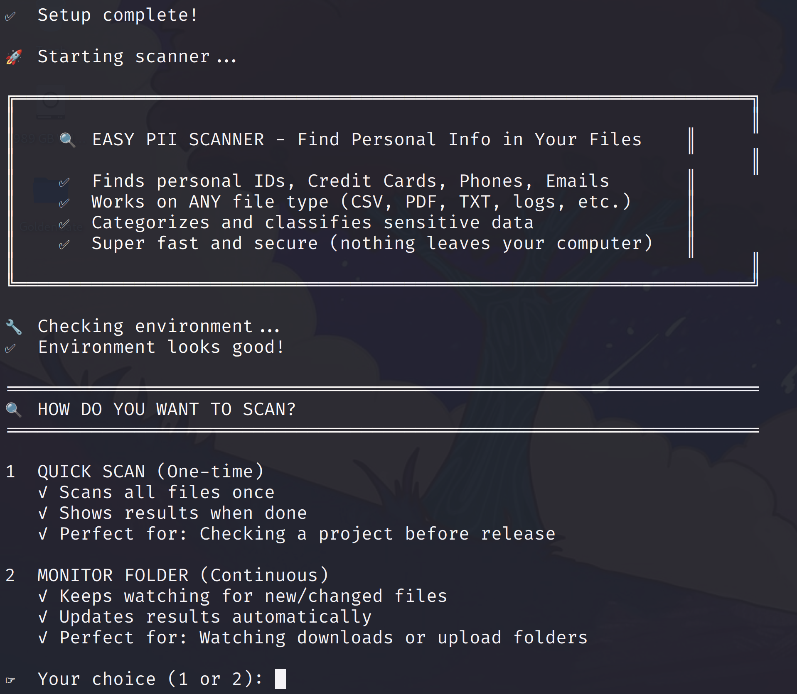
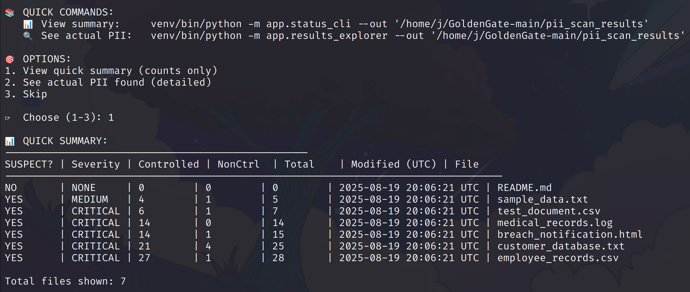
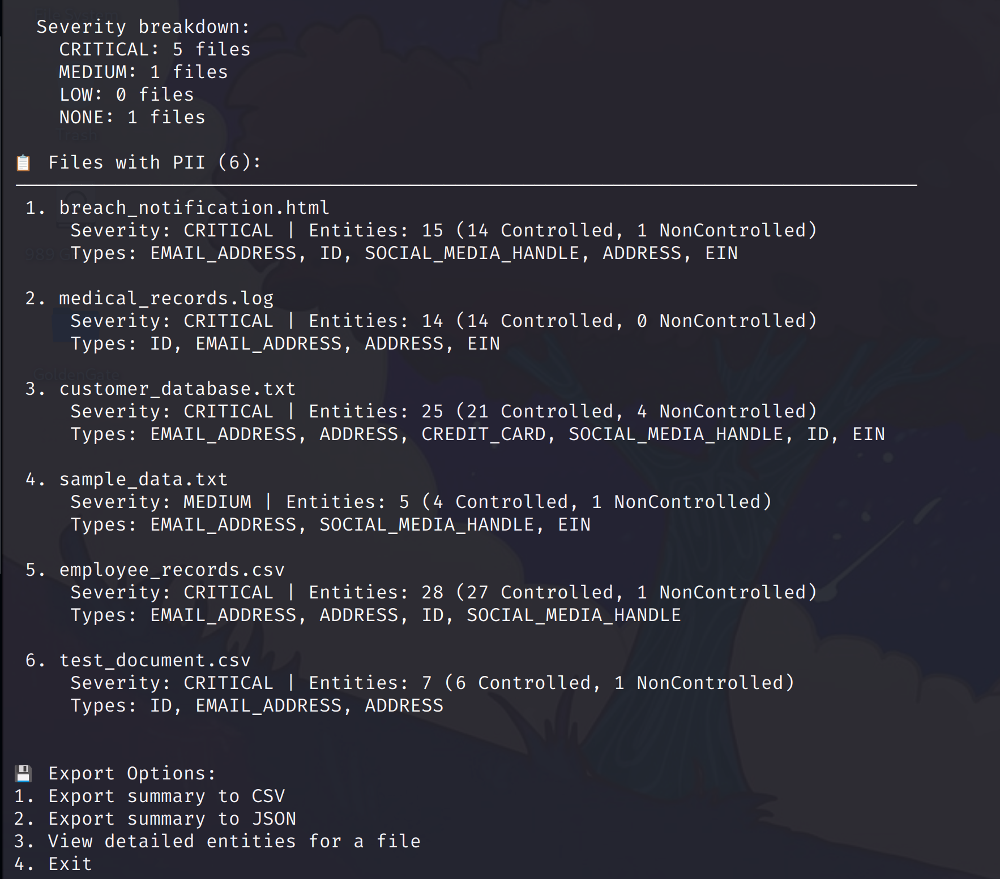
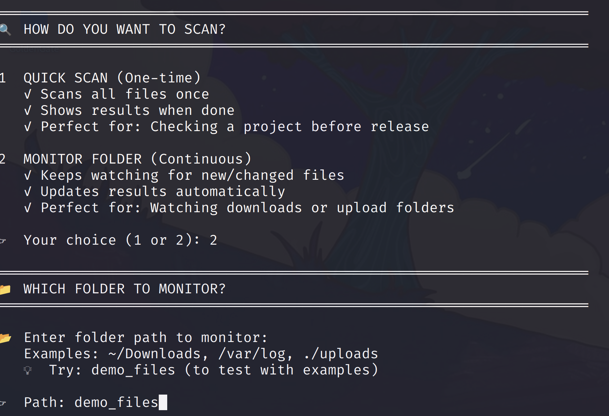

# 🛡️ GoldenGate PII Scanner

Fast, lightweight tool that finds sensitive data in your files. Now with an **interactive console** for easier scanning!



## ✨ What's New (Dev Branch)

### 🎮 Interactive Console Mode
Experience GoldenGate through our new Metasploit-style interactive console - no more memorizing commands!

```bash
./gg  # Launch interactive console

goldengate > scan .          # Scan current directory
goldengate > demo            # Run a quick demo
goldengate > results         # View findings
goldengate > help            # See all commands
```

## Key Features
- 🎮 **NEW: Interactive Console** - User-friendly interface with tab completion
- 🔍 **Detects 15+ PII types** - IDs, credit cards, phones, emails, addresses, and more
- ⚡ **Lightning fast** - Multi-threaded scanning with smart filtering
- 📊 **Multiple modes** - Console, quick scan, or continuous monitoring
- 💾 **Resource efficient** - Uses only ~240MB RAM, perfect for VMs
- 🔒 **100% offline** - Nothing leaves your machine

## Install

```bash
# Step 1: Install prerequisites (requires sudo password)
sudo apt update && sudo apt install -y python3 python3-pip python3-venv python3-dev git

# Step 2: Clone and setup (no sudo needed)
git clone https://github.com/jefrya123/GoldenGate.git && cd GoldenGate && chmod +x scan view status setup.sh && ./setup.sh

# Or without git:
# Step 1: Install prerequisites (requires sudo password)
sudo apt update && sudo apt install -y python3 python3-pip python3-venv python3-dev curl unzip

# Step 2: Download and setup (no sudo needed)
curl -L https://github.com/jefrya123/GoldenGate/archive/refs/heads/main.zip -o GoldenGate.zip && unzip GoldenGate.zip && cd GoldenGate-main && chmod +x scan view status setup.sh && ./setup.sh
```

## Use

### Option 1: Interactive Console (NEW - Easiest!)
```bash
./gg                     # Launch console
> demo                   # Run demo with sample files
> scan /path/to/folder   # Scan any directory
> results                # View findings
> help                   # See all commands
```

### Option 2: Traditional Commands
```bash
./scan demo_files/        # Test with demo files
./scan /path/to/folder    # Scan a folder
./scan file.txt          # Scan one file
./view                   # See results
```

### Quick Scan Results


### Detailed View


## Interactive Console Features

The new console makes scanning easier than ever:

```
goldengate > demo            # Creates sample files and scans them
🎭 Running GoldenGate Demo
   ✅ Created employee.txt
   ✅ Created customer.csv
   ✅ Created clean.txt

goldengate > status          # Check scan progress
📊 Status - scan_001
   Path: gg_demo
   Status: ✅ Completed
   Duration: 0:00:02
   Found: 9 PII items

goldengate > results         # View formatted results
📊 Scan Results - scan_001
   📁 Files scanned: 3
   ⚠️  Files with PII: 2
   🔍 Total PII found: 9
```

### Console Commands
- `scan <path>` - Scan files or directories
- `demo` - Run interactive demo
- `status` - Check scan progress
- `results` - View scan results
- `list` - Show all scans
- `export` - Export results (CSV/JSON)
- `config` - Manage settings
- `help` - Show help
- `exit` - Exit console

## What It Finds

Personal identifiers, Credit Cards, Phone Numbers, Emails, Addresses, Driver Licenses, Passport Numbers, Tax IDs, Bank Accounts

## Requirements

- Python 3.9+
- 1GB RAM minimum
- Linux/macOS/WSL2

## Monitoring Mode

Watch a folder for new files:



Real-time detection as files are added:


```bash
./scan
# Choose option 2 (Monitor Folder)
# Enter path to watch
# Detects new files automatically
```

## Troubleshooting

**Permission denied:** `chmod +x scan view status setup.sh`

**No module found:** Use `./scan` not `python scan`

**Installation fails:** 
```bash
python3 -m venv venv
source venv/bin/activate
pip install -r requirements.txt
```