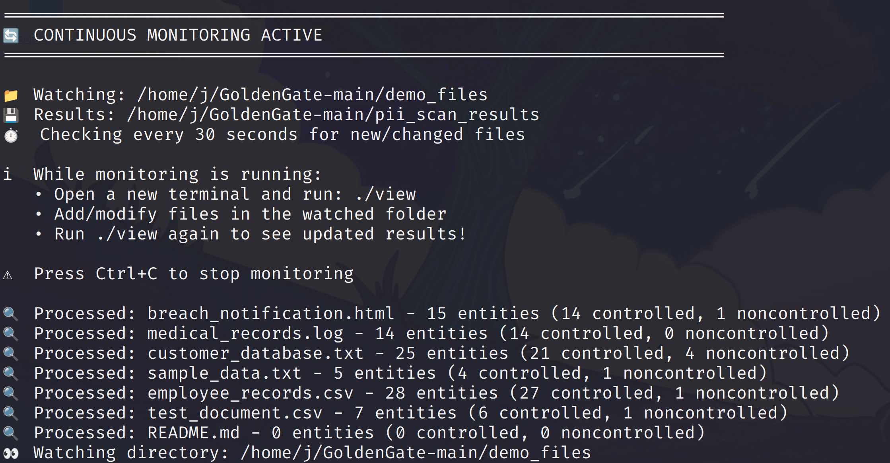

# GoldenGate PII Scanner

Fast, lightweight tool that finds sensitive data in your files. Automatically handles any file size with minimal resource usage (~240MB RAM).


## Key Features
- 🔍 **Detects 15+ PII types** - IDs, credit cards, phones, emails, addresses, and more
- ⚡ **Lightning fast** - Multi-threaded scanning with smart filtering
- 📊 **Two modes** - Quick one-time scan or continuous monitoring
- 💾 **Resource efficient** - Uses only ~240MB RAM, perfect for VMs
- 🔒 **100% offline** - Nothing leaves your machine

## Install

```bash
# Step 1: Install prerequisites (requires sudo password)
sudo apt update && sudo apt install -y python3 python3-pip python3-venv python3-dev git

# Step 2: Clone and setup (no sudo needed)
git clone https://github.com/jefrya123/GoldenGate.git && cd GoldenGate && chmod +x scan view status setup.sh && ./setup.sh

# Or without git:
# Step 1: Install prerequisites (requires sudo password)
sudo apt update && sudo apt install -y python3 python3-pip python3-venv python3-dev curl unzip

# Step 2: Download and setup (no sudo needed)
curl -L https://github.com/jefrya123/GoldenGate/archive/refs/heads/main.zip -o GoldenGate.zip && unzip GoldenGate.zip && cd GoldenGate-main && chmod +x scan view status setup.sh && ./setup.sh
```

## Use

```bash
./scan demo_files/        # Test with demo files
./scan /path/to/folder    # Scan a folder
./scan file.txt          # Scan one file
./view                   # See results
```

### Quick Scan Results


### Detailed View


## What It Finds

Personal identifiers, Credit Cards, Phone Numbers, Emails, Addresses, Driver Licenses, Passport Numbers, Tax IDs, Bank Accounts

## Requirements

- Python 3.9+
- 1GB RAM minimum
- Linux/macOS/WSL2

## Monitoring Mode

Watch a folder for new files:


Real-time detection as files are added:



```bash
./scan
# Choose option 2 (Monitor Folder)
# Enter path to watch
# Detects new files automatically
```

## Troubleshooting

**Permission denied:** `chmod +x scan view status setup.sh`

**No module found:** Use `./scan` not `python scan`

**Installation fails:** 
```bash
python3 -m venv venv
source venv/bin/activate
pip install -r requirements.txt
```